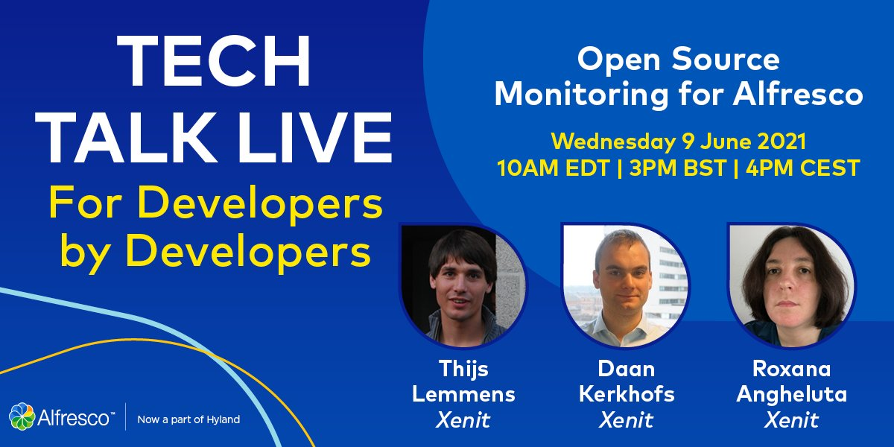
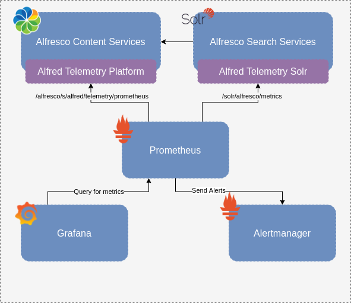

# Tech Talk Live - Open Source Monitoring for Alfresco



Github repository with demonstrations for Alfresco Tech Talk Live about monitoring

## Starting the environment

This project uses the [Alfresco Docker Gradle Plugins](https://github.com/xenit-eu/alfresco-docker-gradle-plugin)
to easily startup an Alfresco stack including various monitoring tools and components.

Assuming Docker is correctly setup on your environment, the stack can be started by executing a single command:

```groovy
./gradlew composeUp
```

## Environment



Once started, following services are available and have one or more ports exposed on the docker host:

* Alfresco (6.2.0-ga) - 8080
  * http://localhost:8080/alfresco
* Prometheus - 9090
  * http://localhost:9090/
  * http://localhost:9090/alerts
* Grafana - 3000
  * http://localhost:3000/
* SearchServices (2.0.1)

## Links

* [Alfred Telemetry](https://github.com/xenit-eu/alfred-telemetry)
  * [Platform Documentation](https://github.com/xenit-eu/alfred-telemetry/tree/master/alfred-telemetry-platform)
  * [Solr Documentation](https://github.com/xenit-eu/alfred-telemetry/tree/master/alfred-telemetry-solr)
* [Micrometer.io](https://micrometer.io/)
  * [Documentation](https://micrometer.io/docs/)
* [Alfresco Health Processor](https://github.com/xenit-eu/alfresco-health-processor)
* [Prometheus](https://prometheus.io/)
  * [Documentation](https://www.prometheus.io/docs/introduction/overview/)
* [Grafana](https://grafana.com/)
* [Alfresco Docker Gradle Plugins](https://github.com/xenit-eu/alfresco-docker-gradle-plugin)
* [Xenit Alfresco Docker images](https://github.com/xenit-eu/docker-alfresco)
